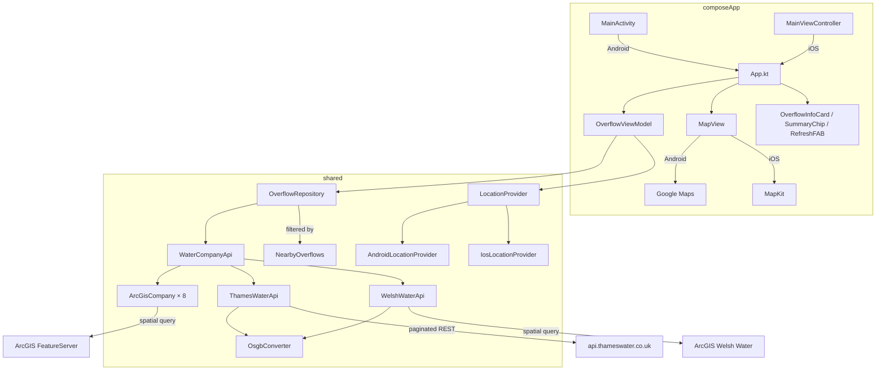
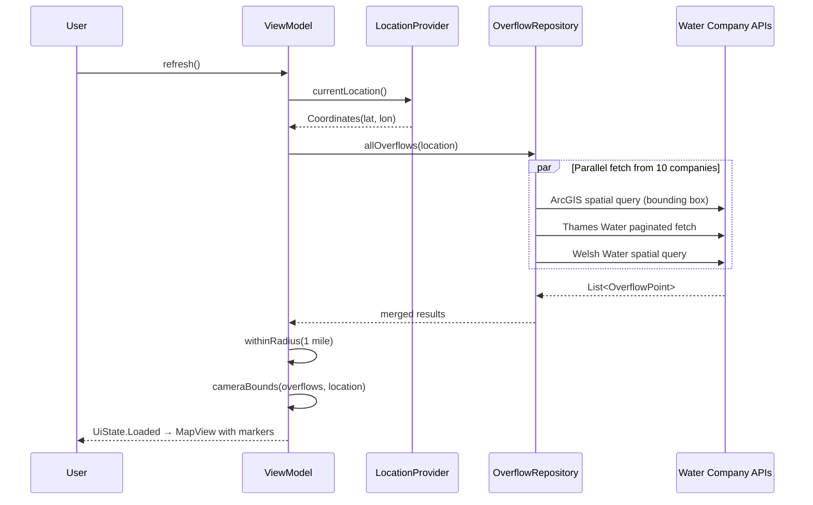
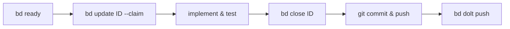

# Turd Alert

Cross-platform mobile app showing real-time sewage storm overflow discharge status near the user's GPS location. Built with Kotlin Multiplatform and Compose Multiplatform, targeting Android and iOS from a single codebase.

Data is fetched directly from 10 UK water company public APIs — no backend required.

## Architecture



## Data flow



## Water companies

| Company | API type | Spatial filtering |
|---------|----------|-------------------|
| Southern Water | ArcGIS FeatureServer | Server-side bounding box |
| Anglian Water | ArcGIS FeatureServer | Server-side bounding box |
| United Utilities | ArcGIS FeatureServer | Server-side bounding box |
| Severn Trent | ArcGIS FeatureServer | Server-side bounding box |
| Yorkshire Water | ArcGIS FeatureServer | Server-side bounding box |
| Northumbrian Water | ArcGIS FeatureServer | Server-side bounding box |
| South West Water | ArcGIS FeatureServer | Server-side bounding box |
| Wessex Water | ArcGIS FeatureServer | Server-side bounding box |
| Thames Water | Custom REST API | Client-side (service area gate + Haversine) |
| Welsh Water | ArcGIS FeatureServer | Server-side bounding box |

All APIs are unauthenticated and publicly accessible.

## Prerequisites

- **Java 21** — `asdf install java temurin-21.0.7+6.0.LTS`
- **Gradle 8.12** — `asdf install gradle 8.12` (or use `./gradlew`)
- **Android SDK** — `brew install android-commandlinetools`, then accept licences:
  ```bash
  sdkmanager --licenses
  sdkmanager "platforms;android-35" "build-tools;35.0.0"
  ```
- **Xcode** (iOS only) — install from the App Store, then:
  ```bash
  brew install xcodegen
  ```

Create `local.properties` pointing to your Android SDK:

```properties
sdk.dir=/opt/homebrew/share/android-commandlinetools
```

## Build and run

### Android

```bash
./gradlew assembleDebug
adb install composeApp/build/outputs/apk/debug/composeApp-debug.apk
```

### iOS simulator

```bash
# Build the KMP framework
./gradlew :composeApp:linkDebugFrameworkIosSimulatorArm64

# Generate and build the Xcode project
cd iosApp && xcodegen generate && cd ..
xcodebuild -project iosApp/iosApp.xcodeproj \
  -scheme iosApp \
  -destination 'platform=iOS Simulator,name=iPhone 17 Pro' \
  build

# Install and run
xcrun simctl boot "iPhone 17 Pro"
APP=$(find ~/Library/Developer/Xcode/DerivedData/iosApp-*/Build/Products/Debug-iphonesimulator -name "iosApp.app" -maxdepth 1)
xcrun simctl install booted "$APP"
xcrun simctl location booted set 53.7133,-2.0974  # Set a fake GPS location
xcrun simctl launch booted com.chicot.turdalert.iosApp
```

## Project structure

```
turd-alert/
├── shared/                          # KMP library (Android + iOS)
│   └── src/
│       ├── commonMain/              # Shared Kotlin code
│       │   └── kotlin/.../
│       │       ├── api/             # HTTP clients, DTOs, coordinate conversion
│       │       ├── domain/          # Proximity filtering
│       │       ├── location/        # LocationProvider interface
│       │       ├── map/             # Directions expect declaration
│       │       ├── model/           # OverflowPoint, BoundingBox, DischargeStatus
│       │       ├── util/            # Haversine distance
│       │       └── viewmodel/       # OverflowViewModel, UiState
│       ├── androidMain/             # Android LocationProvider, Directions actual (Google Maps intent)
│       └── iosMain/                 # iOS LocationProvider, Directions actual (Apple Maps URL)
├── composeApp/                      # Compose Multiplatform UI
│   └── src/
│       ├── commonMain/              # Shared UI (App, MapView expect, OverflowInfoCard, SummaryChip, RefreshFAB)
│       ├── androidMain/             # MainActivity, Google Maps MapView actual
│       └── iosMain/                 # MainViewController, MapKit MapView actual
└── iosApp/                          # iOS app shell (Swift/SwiftUI)
    ├── iosApp/                      # Swift sources + Info.plist
    └── project.yml                  # xcodegen spec
```

## Map UI

The app displays a full-screen interactive map (Google Maps on Android, MapKit on iOS) with coloured markers for each overflow point. Tapping a marker shows an info card with site name, status, duration, and a directions button. A summary chip at the bottom shows the count of discharging/total overflows.

### Marker colours

- **Red** — actively discharging sewage
- **Green** — not discharging
- **Grey** — offline / status unknown

## Key technical details

- **Coordinate conversion**: Thames Water and Welsh Water return OSGB (EPSG:27700) coordinates, converted to WGS84 via Helmert 7-parameter transformation in `OsgbConverter.kt`
- **Bounding box filtering**: ArcGIS companies receive a `geometry` envelope parameter limiting results to ~2 miles around the user, avoiding large payload downloads
- **Thames Water service area gate**: Thames Water lacks server-side spatial queries, so the app skips the API entirely when the user is outside lat 51.0–52.2 / lon -2.2–0.6
- **Per-company error isolation**: Each company is fetched in a separate coroutine; failures return an empty list rather than crashing the whole refresh
- **iOS main thread requirement**: `CLLocationManager` must be created and used on the main thread; the iOS location provider uses `dispatch_async(dispatch_get_main_queue())` and retains strong references to both the manager and delegate to prevent ARC deallocation

## Issue tracking (beads)

This project uses [beads](https://github.com/beads-ai/beads-cli) (`bd`) for issue tracking. Issues are stored in a Dolt database under `.beads/` and exported to `.beads/issues.jsonl` for git portability.

### Setup

```bash
brew install beads-ai/tap/beads
bd init
```

This creates the `.beads/` directory, starts a local Dolt server, and generates an `AGENTS.md` with workflow instructions for AI agents.

### Dolt server

Beads expects a Dolt SQL server on port 3307:

```bash
bd dolt start
```

### Syncing issues

Issues are synced via the git repo itself (`.beads/issues.jsonl` is committed). To push/pull the Dolt database:

```bash
bd dolt push
bd dolt pull
```

### Daily workflow



### Common commands

| Command | Description |
|---------|-------------|
| `bd ready` | Show unblocked issues ready to work |
| `bd create "title" -t feature -p 2` | Create an issue |
| `bd update ID --claim` | Claim an issue |
| `bd close ID` | Mark complete |
| `bd list --status=open` | List open issues |
| `bd show ID` | View issue details |
| `bd dep add A B` | A depends on B |
| `bd dolt push` | Push issues to remote |
| `bd dolt pull` | Pull issues from remote |
