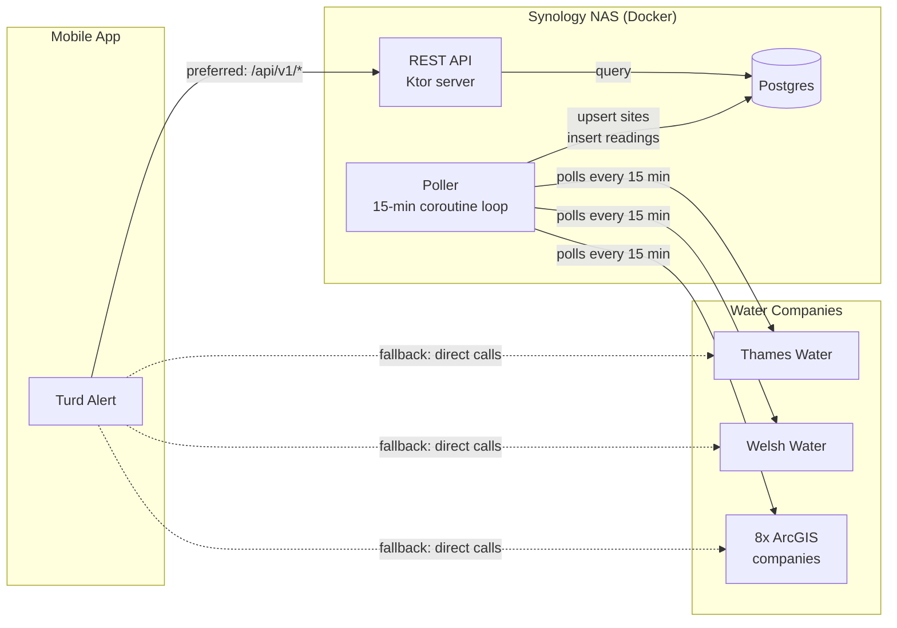

# Historical Overflow Data: Polling, Storage, and Visualization

**Epic:** turd-alert-14r
**Date:** 2026-03-15
**Status:** Draft

## Overview

A backend service that polls all 10 UK water company APIs every 15 minutes, stores complete snapshots in Postgres, and exposes historical data to the mobile app via a REST API. The app adopts a hybrid fetching strategy — preferring the backend for current data but falling back to direct API calls when the backend is unreachable.

## Architecture

### Gradle Modules

```
turd-alert/
├── shared/        # existing KMP module (API clients, models, coordinate conversion)
├── composeApp/    # existing Compose Multiplatform UI
├── iosApp/        # existing iOS shell
├── backend/       # NEW — poller + REST API server (JVM), single entry point
└── db/            # NEW — Postgres schema, migrations (Flyway), repository layer
```

### Prerequisite: JVM Target for `shared` Module

The `shared` module currently declares `androidTarget()` and iOS targets only. A `jvm()` target must be added so the backend can depend on it via `implementation(project(":shared"))`. This requires:

- Adding `jvm()` to `shared/build.gradle.kts` KMP target list
- A `jvmMain` source set providing a JVM Ktor engine (e.g. `ktor-client-cio`)
- Verifying existing `commonMain` code compiles for JVM (expected to work — no platform-specific APIs in the API clients)

### Deployment

Deployed as two Docker containers on a Synology NAS via Docker Compose: one for the backend JAR (poller + REST API), one for Postgres. The `backend` module is the application entry point — it starts the Ktor server and launches the polling coroutine. The `db` module contains the schema, migrations, and repository layer.

Migration path: the same `docker-compose.yml` runs on any Docker host (VPS, cloud VM). For managed Postgres, remove the Postgres container and update the connection string.

### System Diagram



## Data Model

### `sites` Table

Upserted on each poll cycle. If a water company adds, renames, or moves a site, we pick it up automatically.

```sql
create table sites (
    company     text not null,
    site_id     text not null,
    site_name   text,
    watercourse text,
    latitude    double precision not null,
    longitude   double precision not null,

    primary key (company, site_id)
);

create index idx_sites_location on sites (latitude, longitude);
```

Site IDs are scoped to their water company via a composite primary key. This prevents collisions if two companies issue the same permit number or ID.

### `readings` Table

Append-only, partitioned by month on `polled_at`. At ~14,187 sites x 96 polls/day = ~1.36M rows/day, ~497M rows/year.

```sql
create table readings (
    company      text not null,
    site_id      text not null,
    polled_at    timestamptz not null,
    status       smallint not null,   -- 1=discharging, 0=not discharging, -1=offline
    status_start timestamptz,

    primary key (company, site_id, polled_at),
    foreign key (company, site_id) references sites(company, site_id)
) partition by range (polled_at);
```

### Partition Management

Monthly partitions are created automatically by a coroutine that runs once daily at startup and ensures partitions exist for the current month and the next 2 months ahead. This prevents insert failures at month boundaries.

```sql
-- example generated partition
create table readings_2026_03 partition of readings
    for values from ('2026-03-01') to ('2026-04-01');
```

The partition-creation query is idempotent (`IF NOT EXISTS` semantics via checking `pg_catalog.pg_inherits`).

### Status Values

| Value | Meaning | Notes |
|-------|---------|-------|
| 1 | Discharging | Actively discharging sewage |
| 0 | Not discharging | Normal operation |
| -1 | Offline | Status unknown |

`RECENT_DISCHARGE` is not stored. It is derived server-side when serving API responses, using the same logic as the existing app: a site has status `NOT_DISCHARGING` (0) and its `status_start` timestamp is within the last hour. This matches the current `RecentDischarge.kt` behaviour — no change in semantics when the app switches to the backend.

### Storage Estimates

| Metric | Value |
|--------|-------|
| Rows per cycle | ~14,187 |
| Cycles per day | 96 |
| Rows per day | ~1.36M |
| Rows per month | ~41M |
| Rows per year | ~497M |
| Estimated disk per year | 20-30 GB |

## Poller Design

### Scheduling

A single coroutine loop launched at startup. Sequential by design — the next poll cannot start until the current one finishes and the delay elapses. No overlap risk.

```
on startup:
    initialise database connection pool
    loop:
        startTime = now()
        results = pollAllCompanies()       // parallel fetch of 10 APIs
        upsertSites(results)               // batch upsert to sites table
        insertReadings(results, startTime) // batch insert to readings table
        delayUntilNext15MinBoundary()
```

### API Client Reuse

The poller depends on `shared` module via `implementation(project(":shared"))`, reusing:

- All 10 water company API clients (ArcGIS, Thames Water, Welsh Water)
- Response parsing and field mapping
- OSGB-to-WGS84 coordinate conversion
- `OverflowPoint` model

The only difference from the app's usage: the poller passes a UK-wide bounding box instead of the user's viewport.

### Resilience

- **Per-company error isolation** — if one API is down, the other 9 still get polled. Failures are logged, retried next cycle.
- **Idempotent writes** — `ON CONFLICT DO NOTHING` on readings. If the process restarts mid-cycle, re-running is safe.
- **No backfill** — if the poller was down, it resumes from now. Gaps in data are accepted (the data didn't exist while it wasn't polling).
- **Graceful shutdown** — traps SIGTERM, finishes current poll cycle before exiting (systemd integration).

### Database Access

Exposed (JetBrains Kotlin SQL library) with HikariCP connection pool. Batch inserts for readings (~14K rows per cycle).

### Logging

SLF4J + Logback to stdout (captured by systemd journal). Each cycle logs:
- Companies polled successfully / failed
- Readings inserted
- Cycle duration

## REST API Design

Served by Ktor, running in the same process as the poller. All paths prefixed with `/api/v1/`.

### `GET /api/v1/overflows`

Current status for all sites within a bounding box. Replaces the app's direct API calls.

**Parameters:**
- `minLat`, `maxLat`, `minLon`, `maxLon` (required) — viewport bounding box

**Response:** Array of overflow points matching the existing `OverflowPoint` shape:

```json
[
  {
    "id": "PERMIT123",
    "latitude": 51.5074,
    "longitude": -0.1278,
    "status": "DISCHARGING",
    "watercourse": "River Thames",
    "siteName": "Example CSO",
    "statusStart": 1710500000000,
    "company": "THAMES"
  }
]
```

### `GET /api/v1/sites/{company}/{siteId}/history`

Historical readings and statistics for a single site, identified by its composite key.

**Parameters:**
- `company` (path, required) — water company identifier (e.g. `THAMES`, `SOUTHERN`)
- `siteId` (path, required) — site identifier within that company
- `days` (query, optional, default 30) — number of days of history

**Response:**

```json
{
  "site": {
    "id": "PERMIT123",
    "siteName": "Example CSO",
    "watercourse": "River Thames",
    "company": "THAMES",
    "latitude": 51.5074,
    "longitude": -0.1278
  },
  "stats": {
    "totalDischargeHours": 38.5,
    "eventCount": 14,
    "longestEventHours": 8.25,
    "percentDischarging": 5.3,
    "lastDischargeAt": "2026-03-14T08:30:00Z"
  },
  "timeline": [
    { "timestamp": "2026-03-14T08:00:00Z", "status": 1 },
    { "timestamp": "2026-03-14T08:15:00Z", "status": 1 },
    { "timestamp": "2026-03-14T08:30:00Z", "status": 0 }
  ]
}
```

Stats are computed server-side via SQL aggregation. The timeline contains raw readings for charting.

**Timeline size limits:** `days` is capped at 90. For ranges > 7 days, the timeline is downsampled to one reading per hour (picking the "worst" status in each hour — discharging beats not-discharging beats offline). This keeps responses under ~2,200 entries for a 90-day request.

### `GET /api/v1/sites/worst-offenders`

Top 20 sites ranked by total discharge hours within a radius and time period.

**Parameters:**
- `lat`, `lon` (required) — centre point
- `radius` (optional, default 1) — radius in miles
- `days` (optional, default 30) — time period

**Response:**

```json
[
  {
    "site": {
      "id": "PERMIT456",
      "siteName": "Worst CSO",
      "watercourse": "River Lea",
      "company": "THAMES",
      "latitude": 51.55,
      "longitude": -0.05
    },
    "stats": {
      "totalDischargeHours": 142.0,
      "eventCount": 23,
      "longestEventHours": 18.5,
      "percentDischarging": 19.7,
      "lastDischargeAt": "2026-03-15T02:15:00Z"
    }
  }
]
```

Spatial filtering uses a bounding box pre-filter in SQL followed by Haversine distance check. PostGIS is not needed for this scale.

### `GET /api/v1/health`

Basic liveness and operational status.

**Response:**

```json
{
  "status": "ok",
  "lastPollAt": "2026-03-15T14:15:00Z",
  "lastPollDurationMs": 12340,
  "companiesPolled": 10,
  "companiesFailed": 0,
  "databaseReachable": true,
  "uptimeSeconds": 86400
}
```

### Shared Concerns

- **No authentication** — the underlying data is public
- **JSON serialisation** — kotlinx-serialization
- **No rate limiting initially** — can add if needed
- **Status mapping** — the database stores `smallint` (1/0/-1) but API responses return the `DischargeStatus` enum string (`DISCHARGING`, `RECENT_DISCHARGE`, `NOT_DISCHARGING`, `OFFLINE`). `RECENT_DISCHARGE` is derived server-side from `status_start` (see Status Values section). `statusStart` in the response is taken from the most recent reading's `status_start` field.

## App Integration

### Hybrid Fetching

A new `HybridOverflowRepository` wraps the existing `OverflowRepository`:

```
try:
    response = httpClient.get("/api/v1/overflows?minLat=...&maxLat=...&...")
    return response.map { it.toOverflowPoint() }
catch (timeout / network error):
    return existingRepository.allOverflows(bounds)
```

- Backend request timeout: 3-5 seconds (fast fallback)
- Both paths produce `List<OverflowPoint>` — the rest of the app is unaware of the source
- Config flag `useBackend: Boolean` to disable backend path during development

### Historical Data UI

**Per-site history (tap a pin):**

1. Existing info card remains unchanged (site name, watercourse, current status, status start time)
2. New "History" section below the existing card content
3. Stats row: total discharge hours | event count | "last discharged X ago"
4. Timeline chart: horizontal bar/gantt showing discharge periods over 30 days — red bars for discharge, gaps for clean periods

**Worst offenders screen:**

- Accessible from the main map screen (list icon in toolbar)
- Ranked list: site name, watercourse, total discharge hours, event count
- Tap an entry to navigate to it on the map and open its history

### Graceful Degradation

| Backend state | Current data | Historical data |
|---------------|-------------|-----------------|
| Reachable | From backend (single fast request) | Available (history card, worst offenders) |
| Unreachable | Fallback to direct API calls | "Historical data unavailable" message |
| No network | Cached pins from last session | Unavailable |

The core map experience is never blocked by backend availability. History fetches happen after the info card is opened, not on map load.

## Technology Choices

| Component | Technology | Rationale |
|-----------|-----------|-----------|
| Poller runtime | Kotlin/JVM | Reuses shared module API clients |
| HTTP server | Ktor | Already used in shared module, lightweight |
| Containerisation | Docker Compose | Reproducible deployment, same locally and on NAS/hosted |
| Database | Postgres | Runs anywhere Docker runs, relational, mature |
| Migrations | Flyway | Standard, works with Gradle |
| DB access | Exposed (JetBrains) | Idiomatic Kotlin, lightweight |
| Connection pool | HikariCP | Industry standard, low overhead |
| Scheduling | Coroutine loop | Simple, no overlap, no framework overhead |
| Logging | SLF4J + Logback | Standard JVM logging |
| Serialisation | kotlinx-serialization | Already used throughout the project |

## Deployment

### Target: Synology NAS via Docker Compose

The backend runs as two containers on a Synology NAS using Container Manager (Docker):

```yaml
# docker-compose.yml
services:
  postgres:
    image: postgres:16-alpine
    restart: unless-stopped
    environment:
      POSTGRES_DB: turdalert
      POSTGRES_USER: turdalert
      POSTGRES_PASSWORD: ${POSTGRES_PASSWORD}
    volumes:
      - postgres-data:/var/lib/postgresql/data
    ports:
      - "5432:5432"

  backend:
    build: .
    restart: unless-stopped
    depends_on:
      - postgres
    environment:
      DATABASE_URL: jdbc:postgresql://postgres:5432/turdalert
      DATABASE_USER: turdalert
      DATABASE_PASSWORD: ${POSTGRES_PASSWORD}
    ports:
      - "8080:8080"

volumes:
  postgres-data:
```

**Dockerfile** for the backend:

```dockerfile
FROM eclipse-temurin:21-jre-alpine
COPY backend/build/libs/backend-all.jar /app/backend.jar
ENTRYPOINT ["java", "-Xmx256m", "-jar", "/app/backend.jar"]
```

### Deployment Workflow

1. Build locally: `./gradlew :backend:shadowJar`
2. Build Docker image: `docker build -t turd-alert-backend .`
3. Copy `docker-compose.yml` and image to NAS (via `docker save`/`docker load` or a local registry)
4. On the NAS: `docker compose up -d`

Container Manager's web UI provides logs, restart controls, and resource monitoring.

### Postgres Tuning

Applied via a custom `postgresql.conf` mounted into the container, or via `command` args in compose:

```
shared_buffers = 128MB
max_wal_size = 1GB
checkpoint_completion_target = 0.9
wal_buffers = 16MB
synchronous_commit = off
```

`synchronous_commit = off` is acceptable — in a crash, we lose at most the last few hundred milliseconds of writes. Since we accept data gaps from downtime anyway, this is a worthwhile trade for reduced write pressure.

### Backup

Daily `pg_dump` via a scheduled task in DSM (Task Scheduler), writing compressed dumps to a separate shared folder on the NAS. The NAS's own backup tools (Hyper Backup) can then replicate these offsite. At ~20-30 GB/year uncompressed, this is well within NAS storage capacity.

### Migration to Hosted

The same `docker-compose.yml` runs on any Docker host (VPS, cloud VM). For managed Postgres (e.g. RDS, Neon), remove the `postgres` service and update `DATABASE_URL` to point at the managed instance.

## Future Considerations

- **PostGIS:** Add if spatial queries become more complex (e.g. downstream impact analysis)
- **Worst-offenders query optimisation:** If the join across many site IDs and large reading partitions becomes slow, consider a materialised view or daily summary table. Not expected to be needed at initial scale.
- **Data retention:** Drop/archive partitions older than N years if storage becomes a concern
- **Push notifications (Phase B):** The poller already detects status changes — adding FCM/APNs dispatch is a natural extension
